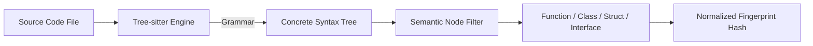

[ 🌐 **English** | [Tiếng Việt](../vi/architecture.md) | [日本語](../ja/architecture.md) ]
---

# Technical Architecture

Deep technical overview of Forge Harness's internal kernel, AST parsing engine, and cryptographic verification model.

---

## Architectural Principles

1. **Deterministic Verification**: No heuristic guessing or probabilistic LLM judgment at gate validation. Either an AST symbol exists and matches, or it does not.
2. **Minimal Dependency Budget**: Forge depends strictly on **Tree-sitter** (for parsing) and **PyYAML** (for metadata). No heavy web frameworks, databases, or cloud requirements.
3. **Machine Regeneration**: The derived tier (`docs/system/derived/`) is pure machine truth regenerated from Git HEAD; humans never author it.

---

## AST Parsing & Language Grammars

Forge uses **Tree-sitter** to extract semantic AST nodes across multiple programming languages:

### Supported Languages
* **Python**: `def`, `async def`, `class`, module variables.
* **TypeScript / JavaScript**: `function`, `class`, `interface`, `type`, `const` exports.
* **Go**: `func`, `type` struct/interface, `const`.
* **C#**: `class`, `interface`, `record`, `struct`, method declarations.

### Normalization Logic
To prevent false alarms, the fingerprinting engine:
* Strips docstrings and line comments (`#`, `//`, `/* ... */`).
* Collapses contiguous whitespace and indentation differences.
* Normalizes AST token sequences.

---

## Cryptographic Baselines & SHA Fingerprinting

Every anchored symbol is fingerprinted using a deterministic BLAKE2b/SHA-256 digest:
$$\text{Fingerprint} = \mathcal{H}(\text{Normalize}(\text{AST}(\text{Node})))$$

When Git HEAD moves:
1. If the parent commit SHA matches the recorded baseline and symbol fingerprint is unchanged: **Fresh**.
2. If symbol fingerprint changed: **Stale (Drifted)**.
3. If symbol cannot be resolved: **Missing**.
