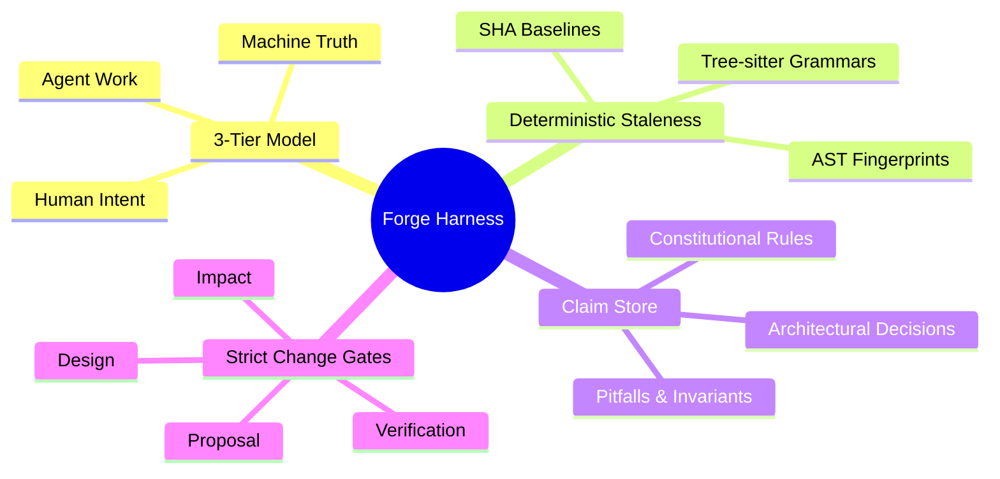

[ 🌐 **English** | [Tiếng Việt](../vi/index.md) | [日本語](../ja/index.md) ]
---

# Forge Harness Overview

**Forge** is an open-source, deterministic software engineering harness that anchors system knowledge directly to code structure. It guarantees that architectural rules, domain models, and development contracts stay strictly synchronized with implementation reality.

---

## The Core Problem

When human developers and AI coding agents collaborate on complex software projects, three critical failures repeatedly emerge:

1. **Context Drift**: Documentation (`README.md`, architectural docs, ADRs) goes stale within weeks as code evolves.
2. **Hallucination & Regression**: AI agents invent non-existent APIs, violate established design patterns, or re-introduce previously solved bugs.
3. **Unchecked Change Lifecycle**: Changes are merged without verifying whether they impact existing architectural claims or break systemic invariants.

Forge solves this by replacing informal documentation with **AST-anchored, cryptographically tracked claims** and **deterministic gate verification**.

---

## Key Pillars



### 1. The 3-Tier Model
* **Tier 1 (Human Intent)**: Authored invariants, domain constraints, and ADRs in `docs/system/`.
* **Tier 2 (Agent Work)**: Active changes in `changes/XXXX-name/` following rigorous proposal, design, and impact lifecycles.
* **Tier 3 (Machine Truth)**: Derived dependency graphs, test suites, and cryptographic inventory in `docs/system/derived/`.

### 2. AST Code Anchoring
Forge doesn't rely on brittle line numbers. Anchors like `src/auth.py#verify_token` or `packages/client/src/index.ts#Client` bind directly to syntax tree symbols via Tree-sitter. Comments, whitespace, and formatting changes are ignored; only structural modifications trigger staleness.

### 3. Change Gates & Attributed Drift
Whenever code changes, Forge calculates the exact subset of claims touched. If a commit modifies anchored code without updating the corresponding claim, Forge flags it immediately:
```text
DRIFT-001  stale  PIT-auth-token-must-be-redacted
                  anchors: src/auth.py#verify_token
                  drift: symbol modified in commit 9a4f21d by Alice
```

---

## Feature Comparison

| Capability | Traditional Linters & CI | Loose Markdown / Wikis | Forge Harness |
| :--- | :---: | :---: | :---: |
| Syntax Checking | ✅ | ❌ | ✅ |
| Systemic Architecture Rules | ❌ | ⚠️ (Manual) | ✅ (Deterministic) |
| AST-anchored Invariants | ❌ | ❌ | ✅ (Language-aware) |
| Staleness Detection | ❌ | ❌ | ✅ (Attributed to commit & author) |
| AI Agent Skill Enforcement | ❌ | ❌ | ✅ (Built-in Skills & Gates) |
| Zero External Cloud Dependency| ✅ | ❌ (Often Notion/Jira) | ✅ (100% Local Git & Files) |

---

## Next Steps
* [Get Started in 30 Seconds](getting-started.md)
* [Understand Core Concepts](concepts.md)
* [Explore CLI Reference](cli-reference.md)
