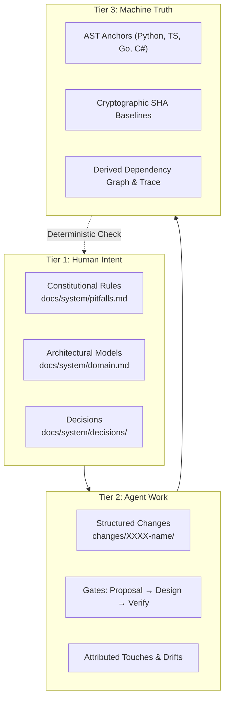

# Forge Harness

<p align="center">
  <strong>Personal Software Engineering Harness with Anchored System Knowledge & Deterministic Staleness Detection</strong>
</p>

<p align="center">
  <a href="https://github.com/CodeGenLabs/forge-harness/actions/workflows/ci.yml"></a>
  
  
  
  
</p>

---

## 🌐 Language / Ngôn ngữ / 言語

| [🇬🇧 English Documentation](en/index.md) | [🇻🇳 Tài liệu Tiếng Việt](vi/index.md) | [🇯🇵 日本語ドキュメント](ja/index.md) |
| :--- | :--- | :--- |

---

## What is Forge?

**Forge** is a personal software engineering harness designed to govern AI coding agents and engineering teams through deterministic verification. 

Instead of relying on LLM self-reporting or loose Markdown notes that drift invisibly as code changes, Forge establishes a **3-Tier Ground Truth System**:



---

## ⚡ Quickstart (30 Seconds)

### 1. Install Globally
```bash
# Recommended using pipx or uv
uv tool install git+https://github.com/CodeGenLabs/forge-harness.git
# or
pipx install git+https://github.com/CodeGenLabs/forge-harness.git
```

### 2. Initialize in Any Project
```bash
cd /path/to/my-project
forge init
forge doctor
forge check
```

---

## 📚 Documentation Navigation

* **[Getting Started](en/getting-started.md)**: Installation options, prerequisites, environment check, and your first repository initialization.
* **[Core Concepts](en/concepts.md)**: 3-Tier model, Claim Store, AST Code Anchoring, Gate Lifecycle, and Attributed Drift.
* **[CLI Reference](en/cli-reference.md)**: Full syntax, arguments, and examples for all 11 subcommands.
* **[Guides & CI/CD](en/guides.md)**: Working with AI Agents (Claude, Gemini, ChatGPT), GitHub Actions workflow, Monorepo setups.
* **[Architecture](en/architecture.md)**: Deep dive into the kernel, AST fingerprints, and cryptographic verification.
* **[Configuration](en/configuration.md)**: Complete `.forge/config.yaml` schema and options.
* **[Troubleshooting](en/troubleshooting.md)**: FAQ, Windows console quirks, PATH troubleshooting, and common gate errors.
