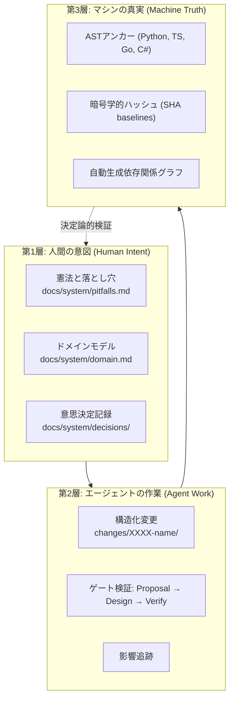

[ [English](../en/index.md) | [Tiếng Việt](../vi/index.md) | 🌐 **日本語** ]
---

# Forge Harness 概要

**Forge** は、システムの知識（アーキテクチャルール、ドメインモデル、設計方針）をコードの実体に直接結びつけ（アンカー）、決定論的に管理するオープンソースのソフトウェアエンジニアリングハーネスです。

---

## 解決する課題

AIコーディングエージェントや開発チームが大規模なプロジェクトで協調作業を行う際、以下の問題が頻発します：

1. **コンテキストの陳腐化 (Context Drift)**: ドキュメント（README、仕様書、ADR）がコードの変更に追従できず、数週間で形骸化する。
2. **AIのハルシネーションと不具合の再発**: エージェントが存在しないAPIを呼び出したり、過去に修正されたはずの落とし穴（Pitfalls）を再発させる。
3. **無秩序な変更のマージ**: 既存のシステム不変条件（Invariants）に影響を与えていないかを検証せずに変更がマージされる。

Forge は、自然言語による曖昧な文書管理を廃止し、**ASTノードにアンカーされたクレーム (Claims)** と **決定論的ゲート検証** によってコードと仕様の完全な一致を保証します。

---

## 3層アーキテクチャ

---

## ドキュメント一覧
* **[クイックスタート (Getting Started)](getting-started.md)**: インストールとプロジェクト初期化
* **[コアコンセプト (Core Concepts)](concepts.md)**: 3層モデル、クレームストア、ASTアンカー
* **[CLIリファレンス (CLI Reference)](cli-reference.md)**: 全11コマンドの詳細解説
* **[ガイドとCI/CD (Guides)](guides.md)**: AIエージェント連携、GitHub Actions、モノレポ対応
* **[アーキテクチャ (Architecture)](architecture.md)**: カーネル内部、Tree-sitter AST、決定論的ハッシュ
* **[設定リファレンス (Configuration)](configuration.md)**: `.forge/config.yaml` の仕様
* **[トラブルシューティング (Troubleshooting)](troubleshooting.md)**: よくある問題と解決策
