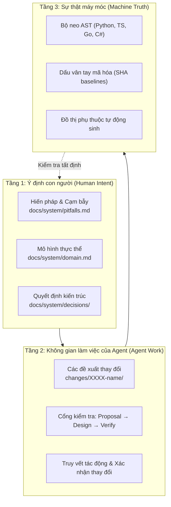

[ [English](../en/index.md) | 🌐 **Tiếng Việt** | [日本語](../ja/index.md) ]
---

# Tổng quan về Forge Harness

**Forge** là một harness kỹ thuật phần mềm mã nguồn mở mang tính tất định (deterministic), có nhiệm vụ neo giữ tri thức hệ thống (system knowledge) trực tiếp vào cấu trúc mã nguồn thực tế. Forge đảm bảo các quy tắc kiến trúc, mô hình nghiệp vụ và hợp đồng phát triển không bao giờ bị lệch lạc so với code thực tế.

---

## Vấn đề cốt lõi mà Forge giải quyết

Khi lập trình viên và các AI coding agent (Claude, Gemini, GPT, Cursor...) cùng làm việc trên các dự án lớn, 3 vấn đề nghiêm trọng luôn xảy ra:

1. **Trôi dạt tri thức (Context Drift)**: Tài liệu kỹ thuật (`README.md`, tài liệu kiến trúc, ADR) bị lỗi thời chỉ sau vài tuần khi code thay đổi.
2. **Ảo giác & Tái phát lỗi (Hallucination & Regression)**: AI agent tự biên chế các hàm không có thật, vi phạm cấu trúc hệ thống hoặc vô tình làm phát sinh lại các lỗi (pitfalls) đã từng được giải quyết trong quá khứ.
3. **Thiếu cổng kiểm soát thay đổi (Unchecked Lifecycle)**: Các tính năng mới được merge vào mà không có công cụ nào kiểm tra xem chúng có làm vi phạm các bất biến (invariants) của toàn hệ thống hay không.

Forge giải quyết triệt để vấn đề này bằng cách thay thế các tài liệu văn bản tĩnh bằng **Các phát biểu có neo giữ cú pháp AST (AST-anchored Claims)** và **Cổng kiểm thử tất định (Deterministic Gates)**.

---

## Ba trụ cột kiến trúc của Forge

---

## Bảng so sánh năng lực

| Năng lực | Linter & CI truyền thống | Tài liệu Markdown / Wiki | Forge Harness |
| :--- | :---: | :---: | :---: |
| Kiểm tra cú pháp | ✅ | ❌ | ✅ |
| Ràng buộc quy tắc kiến trúc | ❌ | ⚠️ (Thủ công) | ✅ (Tất định) |
| Neo giữ AST theo cấu trúc | ❌ | ❌ | ✅ (Hỗ trợ đa ngôn ngữ) |
| Phát hiện tài liệu bị lỗi thời | ❌ | ❌ | ✅ (Chỉ rõ commit & tác giả) |
| Ép buộc quy chuẩn cho AI Agent | ❌ | ❌ | ✅ (Tích hợp Agent Skills) |
| 100% Cục bộ, không cần Cloud | ✅ | ❌ (Thường dùng SaaS) | ✅ (Chạy trên Git cục bộ) |

---

## Đề mục tài liệu
* **[Bắt đầu nhanh (Getting Started)](getting-started.md)**: Cài đặt và thiết lập dự án đầu tiên.
* **[Khái niệm cốt lõi (Core Concepts)](concepts.md)**: Mô hình 3 tầng, Claim Store, Neo AST và Vòng đời thay đổi.
* **[Tra cứu CLI (CLI Reference)](cli-reference.md)**: Danh mục toàn bộ 11 lệnh CLI của Forge.
* **[Hướng dẫn & CI/CD (Guides)](guides.md)**: Làm việc cùng AI Agent, cấu hình GitHub Actions và Monorepo.
* **[Kiến trúc hệ thống (Architecture)](architecture.md)**: Chi tiết về Kernel, Tree-sitter AST và Fingerprints.
* **[Cấu hình hệ thống (Configuration)](configuration.md)**: Hướng dẫn file `.forge/config.yaml`.
* **[Xử lý sự cố (Troubleshooting)](troubleshooting.md)**: Các lỗi thường gặp và cách xử lý.
