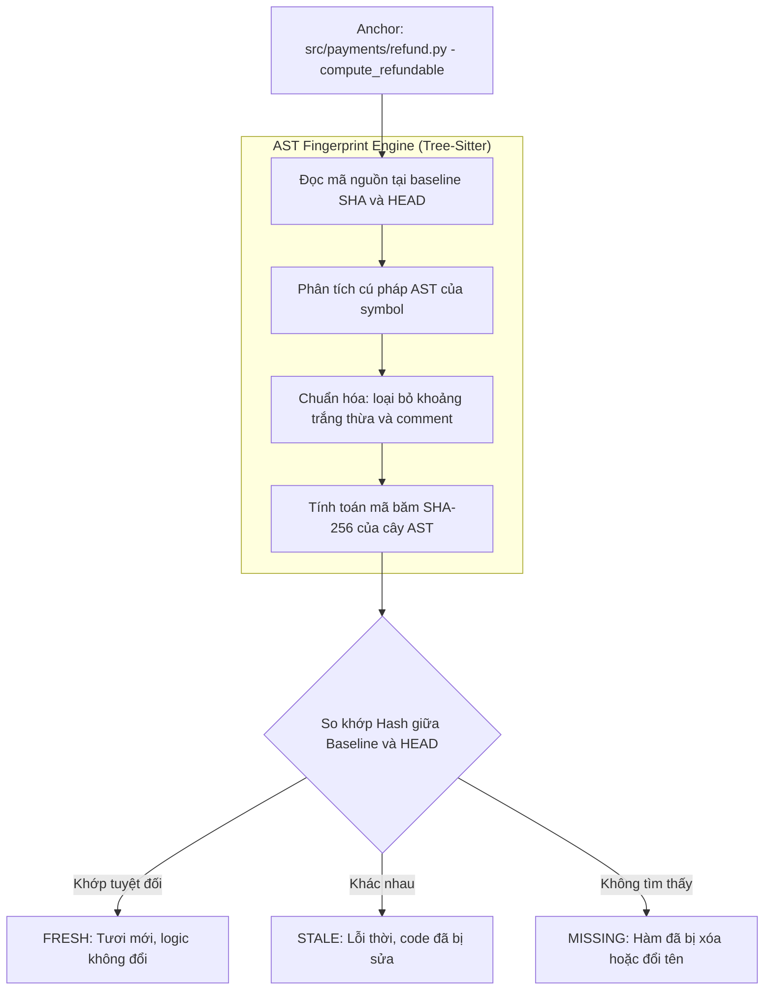

# SYSTEM_KNOWLEDGE.md — Quản lý Tri thức Hệ thống

Tài liệu thiết kế chi tiết về **Tầng Tri thức Hệ thống (System Knowledge)** của Forge.

Đây là tài liệu trụ cột của toàn bộ hệ thống; vòng đời thay đổi trong [workflow.md](workflow.md) và các thành phần kỹ thuật trong [architecture.md](architecture.md) tồn tại là để phục vụ tầng tri thức này.

---

## 0. Vấn đề cốt lõi, được phát biểu lại một cách chính xác

Việc duy trì tri thức cho AI Coding Agent gồm hai bài toán hoàn toàn khác nhau:

- **Bài toán A — Tính hữu ích (Usefulness):** Cung cấp cho AI những tri thức nghiệp vụ, quy tắc ngầm mà nó không thể tự suy ra từ mã nguồn, dưới một định dạng tiêu tốn ít token nhất khi nạp vào ngữ cảnh.
- **Bài toán B — Tính đáng tin cậy (Trustworthiness):** Xác định một cách hoàn toàn cơ học (không đoán mò) xem phần tri thức nào vẫn còn đúng tính đến commit hiện tại, và ngăn chặn việc âm thầm làm sai lệch tài liệu khi sửa code.

Nhiều dự án thất bại vì: hoặc chỉ viết văn xuôi markdown tự do (hữu ích ban đầu nhưng sau vài tuần là mục rữa và lệch pha với code), hoặc dùng linter kiểm tra văn bản mà không ai đọc.

Forge giải quyết cả hai bài toán bằng một phát minh kỹ thuật duy nhất: **Khẳng định có neo và được gắn nhãn nguồn chân lý (Anchored, Truth-source-labelled Claim)** — bởi vì một Claim vừa là đơn vị của tính hữu ích cho AI, vừa là đơn vị của sự kiểm chứng cơ học cho máy tính.

### Ba nguyên tắc nền tảng
1. **Lưu trữ các phán đoán, phái sinh các dữ kiện:** Nếu một kỹ sư có thể đọc code và biết được thông tin đó, thì đó là một dữ kiện (fact) và bắt buộc phải được phái sinh tự động bằng script khi cần, tuyệt đối không lưu cứng trong tài liệu. Tri thức hệ thống chỉ lưu trữ các phán đoán nghiệp vụ và lý do thiết kế.
2. **Lỗi thời là một phép so sánh; tính đúng đắn là một phán đoán:** Phép so sánh là việc của máy tính (Kernel CLI). Phán đoán là việc của con người, với AI đóng vai trò đề xuất. Mô hình AI dễ sụt giảm độ chính xác khi chỉ có code thay đổi mà tài liệu giữ nguyên, do đó AI không thể tự làm bộ phát hiện lỗi thời.
3. **Mỗi dòng ngữ cảnh đều phải trả giá trong mọi phiên làm việc:** Tập hợp tri thức nạp liên tục (always-loaded) có ngân sách cứng (tối đa 400 dòng) và không bao giờ được nâng lên. Mọi tri thức khác đều phải nằm sau một điều kiện kích hoạt theo nhu cầu.

---

## 1. Đơn vị tri thức: Claim (Khẳng định)

**Quy chuẩn: Metadata có cấu trúc + Văn xuôi giải thích, từng claim riêng lẻ, lưu trực tiếp trong Git.**

- Không dùng văn xuôi tự do (vì máy không thể diff và kiểm tra tự động).
- Không dùng YAML/JSON thuần (vì thiếu văn phong diễn giải lý do "tại sao" cho con người và AI hiểu).
- Không dùng database riêng như SQLite (vì không thể review qua Git PR, không thấy được trong `git log`).
- Không dùng đồ thị tri thức cồng kềnh (vì các mối liên kết không thể kiểm chứng cơ học sẽ nhanh chóng trở thành nợ kỹ thuật).

### 1.1 Cấu trúc của một Claim
Một Claim bao gồm: một tiêu đề Markdown mang ID ổn định duy nhất, tiếp theo là khối rào `claim` chứa metadata, và kết thúc bằng phần văn xuôi giải thích nghiệp vụ:

````markdown
### INV-7 — Khoản hoàn tiền không bao giờ vượt quá số tiền đã thu

```claim
kind: invariant
status: enforced
truth-source: tests
anchors:
  - src/payments/refund.py#compute_refundable@a1b2c3d
  - src/payments/refund.py#Refund@a1b2c3d
evidence:
  - test: tests/test_refund.py::test_refund_cannot_exceed_capture
governs: [CMP-payments, API-post-refunds]
since: ADR-0014
reviewed: 2026-09-10
```

Khoản hoàn tiền một phần có tính tích lũy: tổng của tất cả các khoản hoàn tiền đã quyết toán
đối với một đơn hàng mới là giá trị bị giới hạn, không phải từng khoản hoàn riêng lẻ.
Một yêu cầu hoàn tiền vượt quá số dư còn lại sẽ bị từ chối tại ranh giới domain, chứ không
bị kẹp gọt (clamped) — việc âm thầm kẹp gọt sẽ khiến khách hàng bị hoàn thiếu tiền, điều này
còn tồi tệ hơn là gặp lỗi.
````

- **Khối metadata:** Được Kernel phân tích bằng Tree-Sitter và Git để kiểm tra tính hợp lệ cơ học.
- **Phần văn xuôi:** Dành cho AI và kỹ sư hiểu được *lý do tại sao* (trong ví dụ trên: tại sao từ chối lại tốt hơn kẹp gọt số tiền).

### 1.2 Danh mục các trường dữ liệu trong Claim

| Trường | Bắt buộc | Giá trị hợp lệ | Ý nghĩa |
|---|:---:|---|---|
| `kind` | Có | Xem bảng phân loại ở mục 2 | Xác định loại tri thức và quy tắc kiểm định áp dụng |
| `status` | Có | `enforced` \| `asserted` \| `proposed` \| `retired` | `enforced`: có công cụ cơ học báo lỗi khi vi phạm.<br>`asserted`: được tin là đúng, có neo nhưng chưa có test tự động.<br>`proposed`: ứng viên đang chờ phê duyệt.<br>`retired`: đã thu hồi, giữ lại làm lịch sử. |
| `truth-source` | Có | `code` \| `tests` \| `config` \| `spec` \| `decision` \| `derived` | Nguồn thẩm quyền tối cao xác nhận tính đúng đắn |
| `anchors` | Có¹ | Danh sách `path[#Symbol][@sha]` | Đoạn mã trong codebase mà claim này mô tả |
| `evidence` | Có² | Danh sách `test:` / `rule:` / `contract:` / `check:` | Thứ sẽ thất bại về mặt cơ học khi claim bị vi phạm (bắt buộc khi `status: enforced`) |
| `governs` | Không | Danh sách mã Claim | Các claim khác bị ràng buộc bởi claim này |
| `since` | Có³ | `ADR-nnnn` | Quyết định kiến trúc đã tạo ra hoặc sửa đổi claim |
| `supersedes` | Không | ID claim | Mã claim cũ bị thay thế bởi claim này |
| `reviewed` | Có | `YYYY-MM-DD` | Ngày mà con người xác nhận lại nội dung claim |

*Ghi chú:*  
¹ `anchors` chỉ được phép để trống `[]` đối với `kind: constraint` (ràng buộc ngoài repo) hoặc `kind: concept` (từ vựng chung). Mọi loại khác bắt buộc phải có neo.  
² Bắt buộc khi `status: enforced`.  
³ Bắt buộc đối với `kind: architecture` hoặc khi claim đổi trạng thái giữa `asserted` và `enforced`.

### 1.3 Quy tắc định danh (Claim ID Rules)
- **Bất biến và không bao giờ tái sử dụng:** Một ID claim (`INV-7`) là định danh vĩnh viễn.
- **Trích dẫn nguyên văn:** Trong tài liệu và spec luôn viết `INV-7`, không viết văn xuôi "quy tắc hoàn tiền". Điều này giúp lệnh `grep -r INV-7` hoặc `forge trace INV-7` truy vết chính xác 100%.

---

## 2. Bảng Phân loại Claim (Claim Kinds)

```
docs/system/
├── OVERVIEW.md              # Văn xuôi ngắn (<= 1 trang), luôn được nạp. Không chứa claim.
├── domain.md                # INV- (Bất biến) và CON- (Khái niệm domain)
├── architecture.md          # ARC- (Kiến trúc) và CMP- (Thành phần hệ thống)
├── pitfalls.md              # PIT- (Cạm bẫy kỹ thuật & bài học xương máu)
├── security.md              # SEC- (Quy tắc bảo mật)
├── data.md                  # DAT- (Quy tắc dữ liệu và di chuyển migration)
├── decisions/               # ADR-nnnn-<slug>.md (Các quyết định kiến trúc)
└── derived/                 # Tầng phái sinh tự động (trace.json, deps.json, tests.json)
```

| Tiền tố | Loại Claim | Ý nghĩa | Neo vào đâu? |
|---|---|---|---|
| `INV-` | **Invariant** | Điều kiện logic bắt buộc luôn đúng trong hệ thống | Hàm/lớp logic nghiệp vụ |
| `CON-` | **Concept** | Thuật ngữ domain then chốt với định nghĩa chính xác | Ranh giới module hoặc `[]` |
| `ARC-` | **Architecture** | Ranh giới giữa các hệ thống con, quy tắc hướng phụ thuộc | Điểm xuất nhập, config module |
| `CMP-` | **Component** | Định nghĩa một thành phần hệ thống và trách nhiệm của nó | Thư mục hoặc file gốc module |
| `PIT-` | **Pitfall** | Lỗi tinh vi từng xảy ra, nguyên nhân gốc rễ và cách phòng tránh | Vị trí code từng bị lỗi |
| `SEC-` | **Security** | Ranh giới quyền hạn, lưu trữ bí mật, xử lý dữ liệu nhạy cảm | Middleware, auth handler |
| `DAT-` | **Data** | Quy tắc bất biến về schema cơ sở dữ liệu, tính tương thích ngược | Model, file migration |
| `API-` | **API Contract** | Giao ước API đối ngoại không được phép phá vỡ | Route, schema OpenAPI |

---

## 3. Nguồn Chân lý (Truth Sources)

Mỗi claim bắt buộc phải khai báo một `truth-source` duy nhất để xác định thẩm quyền khi có mâu thuẫn:

| Nguồn chân lý | Ý nghĩa | Khi xảy ra mâu thuẫn |
|---|---|---|
| `tests` | Test tự động là cơ quan tài phán tối cao. | Nếu code khác test, code sai. |
| `code` | Bản thân việc triển khai mã nguồn là sự thật duy nhất. | Dành cho các claim mô tả hành vi hiện có đang được neo. |
| `config` | Cấu hình dự án hoặc file schema là nguồn thẩm quyền. | Code phải tuân thủ config. |
| `decision` | Quyết định kiến trúc (ADR) đã được phê chuẩn là nguồn thẩm quyền. | Mọi code vi phạm quyết định đều là bug. |
| `spec` | Bản đặc tả năng lực vĩnh viễn là nguồn thẩm quyền. | Hành vi của hệ thống phải khớp với đặc tả. |

---

## 4. Cơ chế Neo và Phát hiện Lỗi thời bằng AST (AST Staleness)

Đây là cơ chế kỹ thuật cốt lõi giúp Forge phát hiện tài liệu bị lỗi thời một cách hoàn toàn tự động và chính xác:



### Ưu điểm vượt trội:
- **Kháng nhiễu hoàn toàn:** Nếu lập trình viên chỉ đổi comment, sửa định dạng dòng, thêm thụt lề... AST không đổi ➔ Anchor vẫn là `fresh`.
- **Nhạy bén với thay đổi logic:** Chỉ cần đổi một toán tử (`>` thành `>=`) hoặc đổi tên biến ➔ AST thay đổi ➔ Anchor bị đánh dấu là `stale` ngay lập tức.
- **Không tốn chi phí:** Chạy bằng thư viện C của `tree-sitter`, quét hàng trăm anchor chỉ trong vài mili-giây, không tốn một token LLM nào.

---

## 5. Quy tắc Claim-Touch (Claim-Touch Rule)

Khi một Change được thực hiện, Forge áp dụng phép toán tập hợp để kiểm tra trách nhiệm cập nhật tài liệu:

$$\text{Touched Claims} = \{ c \in \text{Claims} \mid \text{anchors}(c) \cap \text{files}(\text{git diff}) \neq \emptyset \}$$

Mọi claim thuộc tập `Touched Claims` bắt buộc phải được giải trình rõ ràng trong file `changes/NNNN/impact.md` dưới 1 trong 3 trạng thái:
1. **`Unaffected`:** Code có sửa đổi nhưng logic nghiệp vụ của claim không bị ảnh hưởng (kèm 1 câu giải thích lý do).
2. **`Updated`:** Logic của claim đã thay đổi; phần văn xuôi của claim đã được sửa lại trong change này.
3. **`Superseded`:** Claim cũ bị bãi bỏ vì có một Quyết định kiến trúc (ADR) mới thay thế nó.

> **Cổng kiểm soát:** Lệnh `forge gate impact:post` sẽ quét và đối chiếu. Nếu có bất kỳ claim nào bị chạm mà thiếu giải trình trong `impact.md`, cổng sẽ báo lỗi và chặn đứng quy trình.

---

## 6. Sổ cái Độ lệch (The Drift Ledger)

Khi chạy `forge drift --store`, nếu phát hiện có anchor bị `stale` (code đã bị sửa lệch khỏi tài liệu), độ lệch sẽ được ghi nhận vào file `docs/system/DRIFT.md`.

Forge **nghiêm cấm việc tự động đối soát (Auto-reconciliation)**: không có lệnh nào tự động sửa lại tài liệu cho khớp với code bừa bãi. Mọi độ lệch phải được con người hoặc AI phân loại vào 1 trong 4 phán quyết (Verdicts):

| Phán quyết | Tên gọi | Ý nghĩa & Hành động xử lý |
|---|---|---|
| **V1** | **Code sai (Code defect)** | Mã nguồn đã vô tình làm sai logic của Claim. Cách xử lý: Sửa lại code cho đúng với Claim ban đầu. |
| **V2** | **Claim sai (Claim invalid)** | Claim ban đầu mô tả sai sự thật. Cách xử lý: Đính chính lại phần văn xuôi của Claim. |
| **V3** | **Quyết định đã đổi (Decision changed)** | Nghiệp vụ thực sự muốn đổi logic. Bắt buộc phải viết một ADR mới để giải thích lý do thay đổi trước khi cập nhật Claim. |
| **V4** | **Claim thiếu sót (Underspecified)** | Claim đúng nhưng chưa bao quát trường hợp biên mới phát sinh. Cách xử lý: Bổ sung chi tiết vào Claim. |

---

## 7. Khả năng Truy vết Hai chiều (Traceability)

Tầng phái sinh `docs/system/derived/trace.json` cung cấp mạng lưới quan hệ 2 chiều hoàn chỉnh:
- **Từ Claim ra ngoài:** Claim này được bảo vệ bởi test nào? Gắn với mã Requirement nào? Được sinh ra từ ADR nào?
- **Từ Code vào trong:** Hàm này trong code đang chịu sự chi phối của những Claim kiến trúc nào?

Lệnh `forge trace <ID>` cho phép tra cứu tức thì toàn bộ nguồn gốc xuất xứ và các thành phần liên đới của bất kỳ quy tắc nào trong hệ thống.
