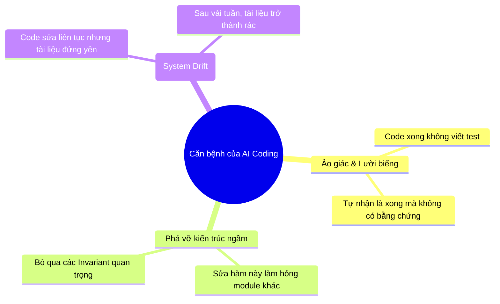
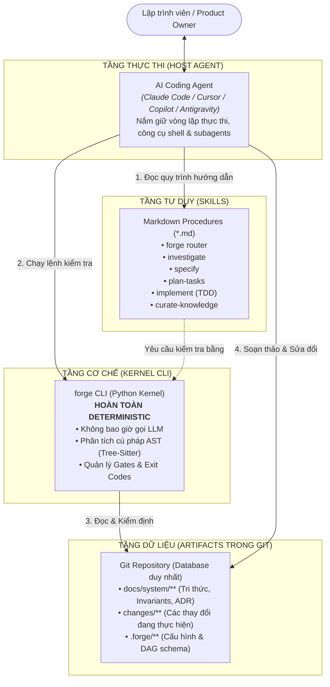
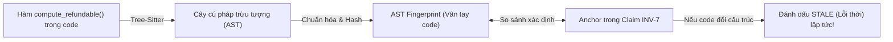
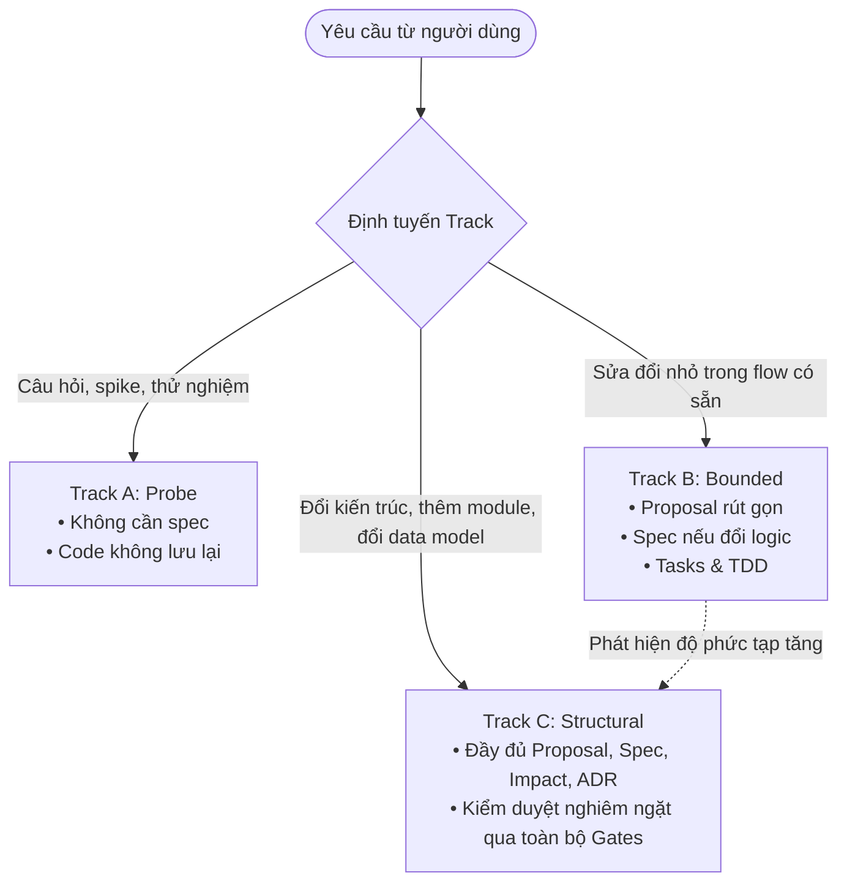
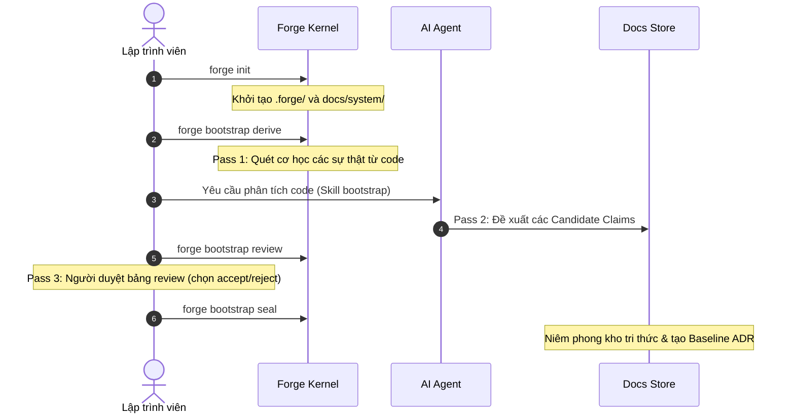

# Forge — Software Engineering Harness cho AI Coding Agent

<p align="center">
  <strong>Bộ khung kỹ nghệ phần mềm cá nhân giúp AI Coding Agent hành xử như một Kỹ sư Senior kỷ luật.</strong><br>
  <em>Khảo sát trước khi sửa • Đặc tả trước khi code • Giữ tri thức hệ thống luôn chính xác và có thể kiểm chứng cơ học.</em>
</p>

<p align="center">
  
  
  
  
  
  
</p>

---

## Mục lục

1. [Tổng quan về Forge](#-tổng-quan-về-forge)
2. [Vấn đề cốt lõi mà Forge giải quyết](#-vấn-đề-cốt-lõi-mà-forge-giải-quyết)
3. [Kiến trúc 3 tầng độc lập](#-kiến-trúc-3-tầng-độc-lập)
4. [Các cơ chế kỹ thuật đột phá](#-các-cơ-chế-kỹ-thuật-đột-phá)
5. [Cài đặt & Bắt đầu nhanh](#-cài-đặt--bắt-đầu-nhanh)
6. [Cẩm nang sử dụng theo kịch bản](#-cẩm-nang-sử-dụng-theo-kịch-bản)
   - [Kịch bản 1: Tiếp quản một dự án có sẵn (Bootstrap)](#kịch-bản-1-tiếp-quản-một-dự-án-có-sẵn-bootstrap)
   - [Kịch bản 2: Vòng đời phát triển tính năng (Change Lifecycle)](#kịch-bản-2-vòng-đời-phát-triển-tính-năng-change-lifecycle)
   - [Kịch bản 3: Giám sát & Quản lý độ lệch tri thức (Drift Management)](#kịch-bản-3-giám-sát--quản-lý-độ-lệch-tri-thức-drift-management)
   - [Kịch bản 4: Tích hợp với AI Coding Agent](#kịch-bản-4-tích-hợp-với-ai-coding-agent)
7. [Bảng tra cứu lệnh CLI (Cheatsheet)](#-bảng-tra-cứu-lệnh-cli-cheatsheet)
8. [Cổng tài liệu chuyên sâu](#-cổng-tài-liệu-chuyên-sâu)

---

## 🌟 Tổng quan về Forge

**Forge** là một bộ khung kiểm soát kỹ nghệ phần mềm (Software Engineering Harness) độc lập, hoạt động trực tiếp trong repository của bạn. Forge phối hợp cùng các AI Coding Agent (Claude Code, Cursor, Copilot CLI, Antigravity,...) để thiết lập một kỷ luật phát triển phần mềm chặt chẽ:

- **Điều tra trước khi sửa:** Không bao giờ sửa code khi chưa nắm rõ hiện trạng và các quy tắc ngầm của hệ thống.
- **Đặc tả trước khi code:** Mọi thay đổi logic đều phải được định nghĩa bằng các yêu cầu và kịch bản có thể kiểm thử trước khi gõ dòng code đầu tiên.
- **Tri thức hệ thống có thể kiểm chứng cơ học (Verifiable System Knowledge):** Giải quyết dứt điểm vấn đề tài liệu bị lỗi thời (drift) so với code mà không cần tốn chi phí gọi LLM để rà soát.

---

## 🎯 Vấn đề cốt lõi mà Forge giải quyết

Khi lập trình cùng các AI Coding Agent trong các dự án thực tế, các lập trình viên thường gặp phải ba "căn bệnh" kinh niên:



### So sánh đối đầu

| Khi không có Forge | Khi có Forge Harness giám sát |
|---|---|
| **Dựa dẫm vào Prompt:** Nhắc AI "Hãy cẩn thận", nhưng AI vẫn bỏ qua hoặc quên luật khi context quá dài. | **Cổng kiểm soát xác định (Deterministic Gates):** Kiểm tra bằng exit code của máy tính. Không đạt chuẩn là chặn đứng, không thể thương lượng. |
| **Sửa code tự do:** Nhảy vào gõ code ngay, sửa triệu chứng thay vì giải quyết nguyên nhân gốc rễ. | **Bắt buộc TDD:** Viết test đỏ trước, viết code xanh sau, tuân thủ phạm vi file đã khai báo. |
| **Tài liệu mục rữa:** Tài liệu viết ra một lần rồi không ai cập nhật, code đi một đằng tài liệu đi một nẻo. | **Khẳng định có neo (Anchored Claims):** Tri thức được neo vào cây cú pháp (AST) của code. Code đổi là hệ thống lập tức phát hiện. |

---

## 🏛️ Kiến trúc 3 tầng độc lập

Forge được thiết kế với sự phân định rạch ròi về mặt trách nhiệm, tuân thủ nguyên tắc: **Máy tính làm việc máy tính giỏi nhất (tính toán, so khớp, kiểm tra exit code), AI làm việc AI giỏi nhất (đọc hiểu nghiệp vụ, lập luận, viết code).**



### 3 Nguyên tắc bất di bất dịch (Inviolable Rules)
1. **Kernel không bao giờ gọi mô hình AI:** Mọi kết quả từ `forge` CLI đều có thể tái lập 100% từ commit của repository.
2. **Skill không có quyền tự cưỡng chế:** Mọi sự ngăn chặn đều phải xuất phát từ exit code của lệnh Kernel CLI.
3. **Mọi trạng thái đều là văn bản trong Git:** Không dùng database riêng, không daemon chạy ngầm, không cache ngầm gây lệch pha.

---

## ⚡ Các cơ chế kỹ thuật đột phá

### 1. Anchored Claim (Khẳng định có neo AST)
Một đơn vị tri thức trong Forge không phải văn xuôi chung chung, mà là một **Claim có cấu trúc** được neo trực tiếp vào cây cú pháp của mã nguồn:

```markdown
### INV-7 — Khoản hoàn tiền không bao giờ vượt quá số tiền đã thu

```claim
kind: invariant
status: enforced
truth-source: tests
anchors:
  - src/payments/refund.py#compute_refundable@a1b2c3d
evidence:
  - test: tests/test_refund.py::test_refund_cannot_exceed_capture
governs: [CMP-payments]
since: ADR-0014
reviewed: 2026-09-10
```

Khoản hoàn tiền một phần có tính tích lũy: tổng các lần hoàn tiền đã quyết toán
mới là giá trị bị giới hạn. Yêu cầu vượt quá số dư sẽ bị từ chối tại ranh giới domain.
```

- **Phần code block:** Dành cho Kernel CLI tính toán AST fingerprint bằng `tree-sitter`.
- **Phần văn bản phía dưới:** Giải thích lý do ("Why") cho AI và con người hiểu.



---

### 2. Quy tắc Claim-Touch (Claim-Touch Rule)
Khi một lập trình viên hoặc AI sửa code, câu hỏi lớn nhất là: *"Những tài liệu và quy tắc nào bị ảnh hưởng cần phải cập nhật?"*

Thay vì để AI tự đoán, Forge biến việc này thành một **phép toán tập hợp cơ học**:
$$\text{Diff Git của Change} \cap \text{Danh sách Anchors của toàn bộ Claims} = \text{Tập Claims bị chạm}$$

Nếu tập này khác rỗng, lệnh `forge gate impact:post` sẽ **chặn đứng** quá trình làm việc cho đến khi file `impact.md` giải trình đầy đủ từng quy tắc bị chạm (là `unaffected`, `updated` hay `superseded`).

---

### 3. Bộ định tuyến 3 Track (Scale Router)
Không phải công việc nào cũng cần thủ tục nặng nề như nhau. Forge phân chia 3 Track linh hoạt:


*Lưu ý: Cơ chế chuyển Track là **bánh cóc một chiều (one-way ratchet)**: chỉ có nâng hạng lên Track nặng hơn khi phát hiện phức tạp ngầm, không có hạ hạng.*

---

## 🚀 Cài đặt & Bắt đầu nhanh

### Yêu cầu tiên quyết
- **Python >= 3.11**
- **Git**

### 1. Cài đặt môi trường
Tại thư mục chứa dự án:

```bash
# Tạo và kích hoạt môi trường ảo
python -m venv .venv
.venv\Scripts\activate      # Trên Windows
# source .venv/bin/activate # Trên Linux / macOS

# Cài đặt Forge ở chế độ editable kèm bộ ngữ pháp AST
pip install -e ".[grammars,dev]"
```

### 2. Kiểm tra sức khỏe hệ thống
```bash
forge doctor
```
*Khi toàn bộ công cụ (Python, Git, Tree-Sitter grammars, Test runner) đều hợp lệ, lệnh sẽ in ra thông số và trả về mã thoát `0`.*

### 3. Kiểm tra trạng thái hiện tại
```bash
forge status
```

---

## 📖 Cẩm nang sử dụng theo kịch bản

### Kịch bản 1: Tiếp quản một dự án có sẵn (Bootstrap)
Khi bạn muốn đưa một codebase đang có vào sự kiểm soát của Forge theo quy trình 3 bước (3-Pass Bootstrap):



---

### Kịch bản 2: Vòng đời phát triển tính năng (Change Lifecycle)
Đây là quy trình làm việc chuẩn mực hàng ngày khi xây dựng một tính năng mới:

#### Bước 1: Mở một Change mới
```bash
forge change new "hoan-tien-don-hang" --track C
```
*Hệ thống sẽ tạo thư mục độc lập: `changes/0002-hoan-tien-don-hang/`.*

#### Bước 2: Soạn thảo đặc tả (Specify)
Xem quyền đọc ngữ cảnh của giai đoạn:
```bash
forge instructions spec --change 2
```
AI tiến hành viết tài liệu đặc tả delta requirements vào `changes/0002-.../spec/`. Sau đó chạy cổng kiểm tra:
```bash
forge gate spec:post --change 2
```
*(Nếu cú pháp spec sai chuẩn, lệnh trả về mã lỗi `1` và chặn không cho tiếp tục).*

#### Bước 3: Đánh giá ảnh hưởng (Impact Analysis)
```bash
forge impact --change 2
```
Hệ thống in ra danh sách các Claim tri thức bị chạm vào. Điền giải trình vào file `impact.md` và kiểm tra qua cổng:
```bash
forge gate impact:post --change 2
```

#### Bước 4: Lập danh sách công việc & Lập trình TDD
AI lập file `tasks.md` phân rã công việc thành các task nhỏ gắn mã `REQ-`. Thực hiện từng task theo chuẩn **TDD**:
1. Viết Unit Test (Chạy test: ĐỎ / FAIL).
2. Sửa code (Chạy test: XANH / PASS).
3. Refactor code.

#### Bước 5: Kiểm chứng toàn diện (Verify)
Chạy bộ kiểm chứng nghiêm ngặt trước khi hợp nhất:
```bash
forge verify --change 2
```
*Kiểm tra 8 điều kiện bắt buộc: toàn bộ test suite phải đỗ, mọi requirement đều có test bao phủ, không vi phạm quy tắc claim-touch.*

#### Bước 6: Lưu trữ và gập đặc tả (Archive & Fold)
```bash
forge archive --change 2
```
*Forge tự động gập (fold) các đặc tả delta vào tài liệu hệ thống chính thức `docs/system/`, cập nhật commit hash của các anchor và đóng gói change.*

---

### Kịch bản 3: Giám sát & Quản lý độ lệch tri thức (Drift Management)

Để đảm bảo tài liệu không bao giờ bị "bỏ rơi" khi code thay đổi:

- **Kiểm tra độ lệch toàn bộ kho tri thức:**
  ```bash
  forge drift --store
  ```
- **Kiểm tra độ lệch riêng cho các file đang sửa dở (git diff):**
  ```bash
  forge drift --changed
  ```
- **Ghi nhận độ lệch vào sổ cái (Drift Ledger):**
  ```bash
  forge drift record
  ```
- **Chạy 18 bài kiểm tra toàn vẹn định kỳ:**
  ```bash
  forge check
  ```

---

### Kịch bản 4: Tích hợp với AI Coding Agent

Để AI Coding Agent (Claude Code, Cursor, Copilot, Antigravity) tự giác tuân thủ Forge, bạn chỉ cần tạo file chỉ dẫn ở thư mục gốc (ví dụ: `CLAUDE.md` hoặc quy tắc hệ thống của agent):

```markdown
# Chỉ dẫn vận hành Forge trong Repository này
- Mọi thay đổi logic hoặc mã nguồn BẮT BUỘC phải đi qua Forge Harness.
- Bắt đầu mọi yêu cầu bằng việc chạy `forge status` và đọc skill: `forge skill show forge`.
- Luôn mở change mới (`forge change new`) và vượt qua các cổng kiểm soát (`forge gate <point>`).
- Tuyệt đối tuân thủ TDD: Viết test trước, sửa code sau.
- Chỉ coi là hoàn thành sau khi `forge verify --change <N>` đạt 100% PASS.
```

---

## 🛠️ Bảng tra cứu lệnh CLI (Cheatsheet)

| Lệnh CLI | Mô tả chức năng | Mã trả về |
|---|---|:---:|
| `forge doctor` | Kiểm tra môi trường (Python, Git, Tree-Sitter, Test runner) | 0 / 1 |
| `forge status` | Báo cáo tổng quan trạng thái hệ thống, claims, tests, change hiện tại | 0 |
| `forge check` | Chạy 18 bài kiểm tra toàn vẹn tri thức (S1–S18) và tính tươi mới | 0 / 1 |
| `forge init` | Khởi tạo cấu trúc `.forge/` và `docs/system/` trong repo | 0 |
| `forge change new "<tên>" --track <A\|B\|C>` | Tạo nhánh thay đổi mới theo track chỉ định | 0 / 2 |
| `forge change show <N>` | Hiển thị tiến độ và các artifact còn thiếu của change | 0 |
| `forge gate <point> --change <N>` | Chạy cổng kiểm soát tại điểm chuyển giao (`spec:post`, `impact:post`,...) | 0 / 1 |
| `forge impact --change <N>` | Tính toán bán kính ảnh hưởng và tập claim bị chạm | 0 |
| `forge verify --change <N>` | Kiểm chứng 8 điều kiện thực tế (chạy test, tính hợp lệ) | 0 / 1 |
| `forge archive --change <N>` | Gập delta spec vào hệ thống chính và lưu trữ change | 0 / 1 |
| `forge drift --store` | Quét toàn bộ kho tri thức tìm các anchor bị lỗi thời (stale) | 0 / 1 |
| `forge drift --changed` | Quét độ lệch cho các file đang nằm trong git diff hiện tại | 0 / 1 |
| `forge claim new <kind> [--append]` | Tạo khung mẫu claim mới (invariant, concept, architecture,...) | 0 |
| `forge trace <ID>` | Truy vết hai chiều cho một mã Claim (code, test, ADR, change) | 0 |
| `forge skill list` | Liệt kê các quy trình kỹ năng tích hợp sẵn cho AI Agent | 0 |

---

## 📚 Cổng tài liệu chuyên sâu

Hệ thống tài liệu thiết kế và đặc tả chi tiết của Forge được tổ chức ngay trong thư mục này:

- 🏛️ **[ARCHITECTURE.md](ARCHITECTURE.md) — Kiến trúc hệ thống Forge**  
  *Phân tích chi tiết thiết kế 3 tầng, cấu trúc thư mục, command surface, ngân sách tăng trưởng và mô hình trạng thái.*
- 🧠 **[SYSTEM_KNOWLEDGE.md](SYSTEM_KNOWLEDGE.md) — Tài liệu trụ cột về Tri thức hệ thống**  
  *Mô hình Anchored Claims, lược đồ schema, nguồn chân lý (truth sources), thuật toán phát hiện lỗi thời bằng AST và chính sách chống nhiễu.*
- 🔄 **[WORKFLOW.md](WORKFLOW.md) — Toàn bộ Vòng đời phát triển & Hệ thống Gates**  
  *Định nghĩa chi tiết 3 Track, từng giai đoạn trong vòng đời thay đổi, các cổng kiểm soát con người và cơ học.*
- 📜 **[CONSTITUTION.md](CONSTITUTION.md) — Bản hiến pháp kỹ nghệ Forge**  
  *16 nguyên tắc kỹ nghệ bất biến, cơ chế phát hiện vi phạm và chính sách miễn trừ.*
